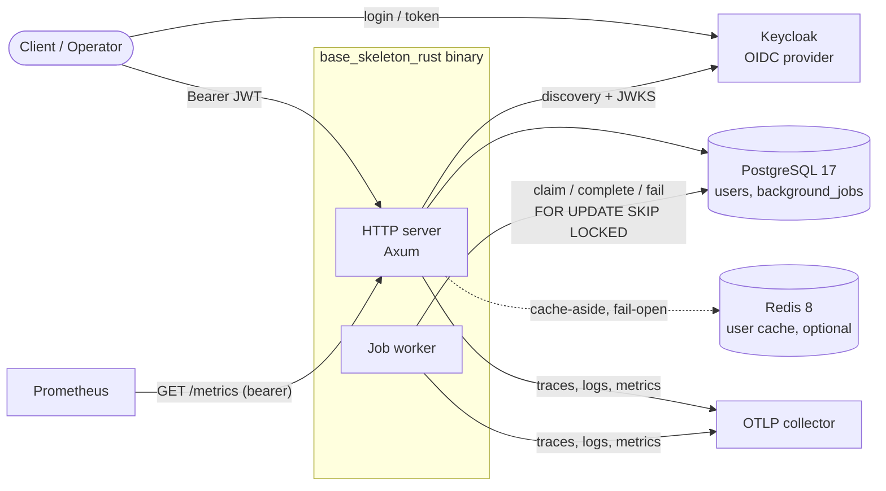
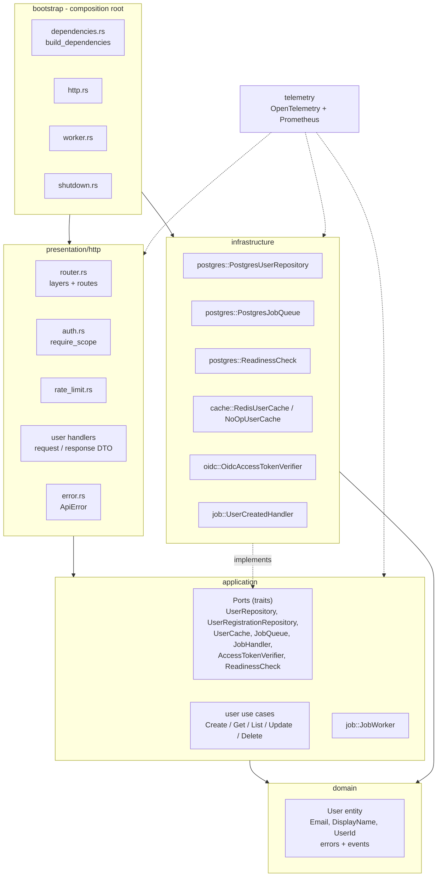
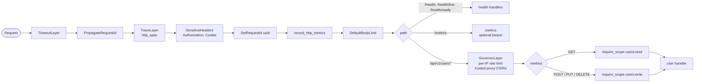
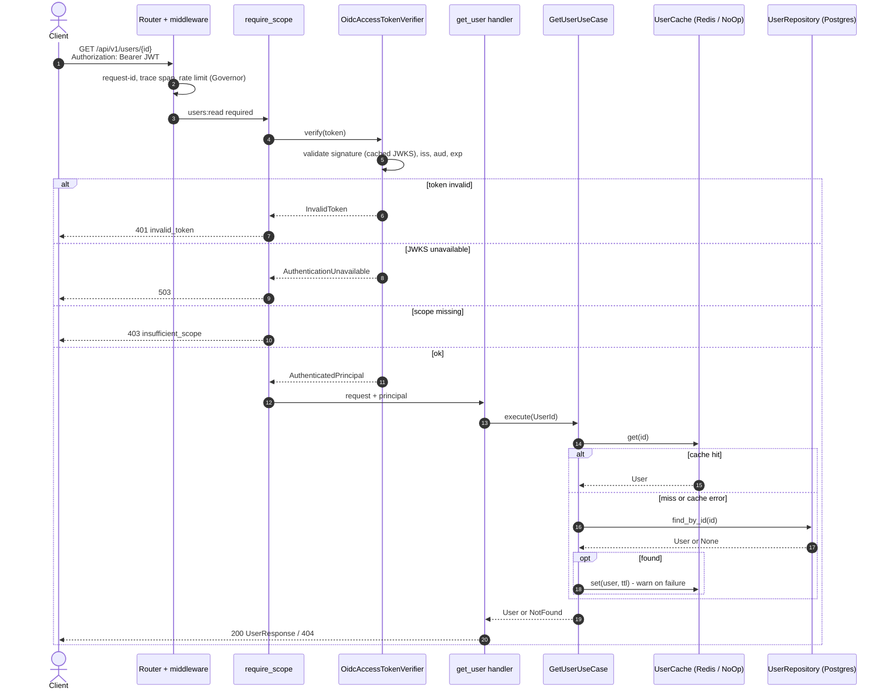
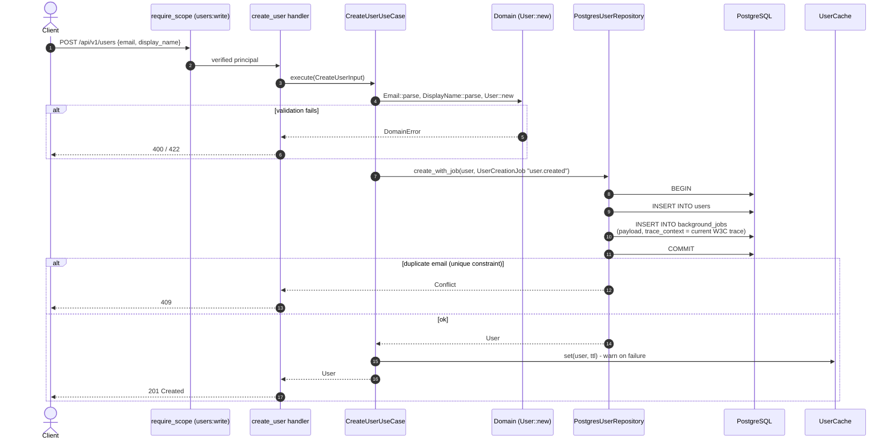
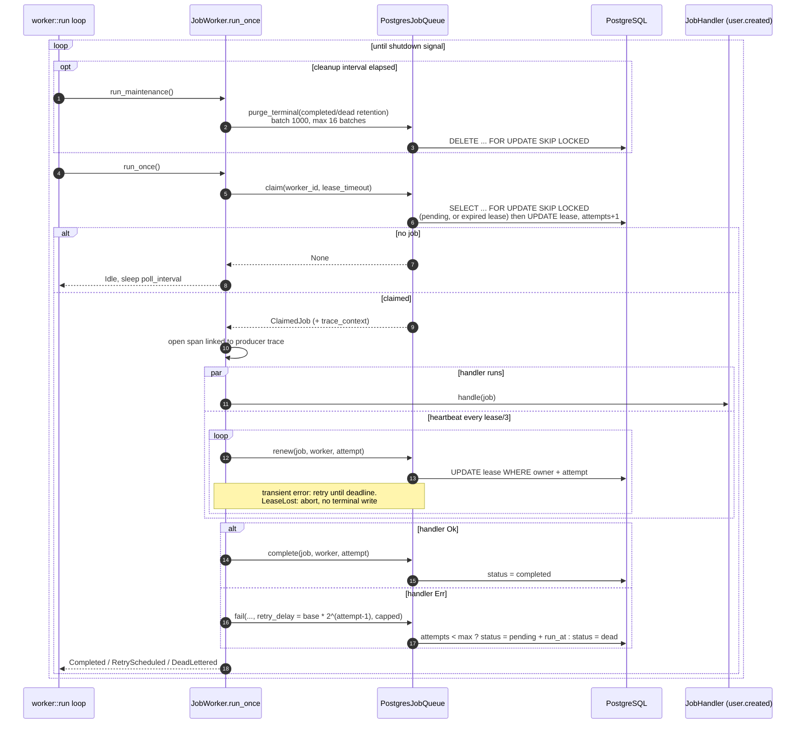
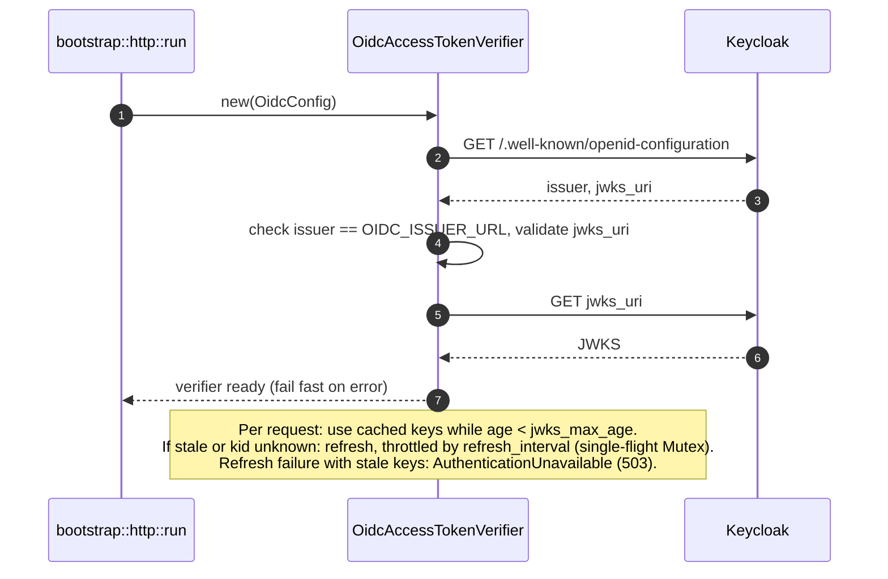

# Architecture & Sequence Diagrams

Ringkasan visual (Mermaid) dari `base_skeleton_rust`. Diverifikasi terhadap kode di `src/`.

## 1. Arsitektur sistem (deployment)

CLI mode: `http`, `worker`, `all [--migrate]` (dua komponen satu proses, pool DB dibagi dua), `db migrate|info|revert`, `migration:create`.

## 2. Arsitektur layer (Clean Architecture)

Arah dependensi selalu ke dalam. `bootstrap` adalah composition root yang menyambungkan implementasi ke port.

## 3. Middleware & routing HTTP

## 4. Sequence: request terautentikasi (GET user, cache-aside)

## 5. Sequence: buat user + enqueue job (transactional outbox)

## 6. Sequence: job worker (claim, lease heartbeat, retry)

## 7. Sequence: startup OIDC & JWKS refresh

