# Complete System Architecture

This document is the end-to-end technical reference for `base_skeleton_rust`. It explains the system boundary, runtime processes, clean-architecture layers, HTTP and worker flows, data model, security controls, observability, deployment, failure behavior, and extension rules.

Use this document for system understanding and design review. Use [`../README.md`](../README.md) for setup and operator commands, [`../ARCHITECTURE.md`](../ARCHITECTURE.md) for contributor workflows, and [`keycloak-setup.md`](keycloak-setup.md) for local identity-provider setup.

## Table of contents

1. [Executive summary](#executive-summary)
2. [System context](#system-context)
3. [Architecture principles](#architecture-principles)
4. [Repository and dependency structure](#repository-and-dependency-structure)
5. [Runtime modes and startup](#runtime-modes-and-startup)
6. [HTTP architecture](#http-architecture)
7. [User domain and use cases](#user-domain-and-use-cases)
8. [Authentication and authorization](#authentication-and-authorization)
9. [Rate limiting and proxy trust](#rate-limiting-and-proxy-trust)
10. [Persistence and consistency](#persistence-and-consistency)
11. [Redis caching](#redis-caching)
12. [Durable background jobs](#durable-background-jobs)
13. [Migrations and readiness](#migrations-and-readiness)
14. [Observability](#observability)
15. [Configuration reference](#configuration-reference)
16. [Deployment architecture](#deployment-architecture)
17. [Failure model](#failure-model)
18. [Scaling and capacity](#scaling-and-capacity)
19. [Testing and delivery pipeline](#testing-and-delivery-pipeline)
20. [How to extend the system](#how-to-extend-the-system)
21. [Current boundaries and deliberate limitations](#current-boundaries-and-deliberate-limitations)
22. [Source map and glossary](#source-map-and-glossary)

## Executive summary

The service is a Rust 2024 application built with Axum and Tokio. It exposes an OIDC-protected user CRUD API, stores authoritative state in PostgreSQL, optionally caches individual users in Redis, and processes durable PostgreSQL-backed background jobs.

The most important architectural properties are:

- PostgreSQL is the source of truth and the only required data dependency.
- Redis is an optional performance optimization; Redis failure does not make the service unready.
- User creation and creation of its `user.created` job are one PostgreSQL transaction.
- Background jobs provide at-least-once delivery, leased ownership, exponential retry, and dead-lettering.
- OIDC verification is local after discovery/JWKS fetch, with bounded key-cache age and fail-closed stale-key behavior.
- `/api/*` is protected by scopes and a per-IP token bucket. Health and metrics are excluded from API rate limiting.
- Database readiness means the applied SQLx migration versions and checksums exactly match the binary.
- Logs, traces, and metrics use OpenTelemetry. Metrics can be exported through OTLP and optionally scraped from a Bearer-protected `/metrics` endpoint.
- One binary supports HTTP, worker, combined, and database-management modes.

## System context

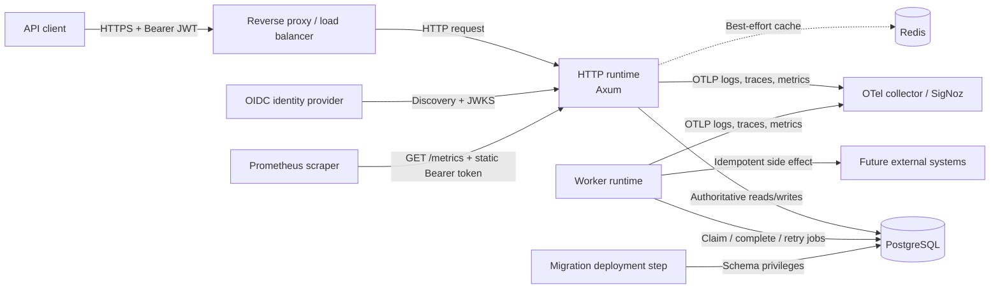

### Actors and trust boundaries

| Actor or system | Role | Trust expectation |
| --- | --- | --- |
| API client | Calls user endpoints with an access token | Untrusted input; all request data and credentials are validated |
| Reverse proxy | Terminates TLS and forwards traffic | Trusted for `X-Forwarded-For` only when its peer IP belongs to `TRUSTED_PROXY_CIDRS` |
| OIDC provider | Issues tokens and publishes discovery/JWKS | Trusted issuer must exactly match configuration; signing algorithms and key purposes are constrained |
| PostgreSQL | Authoritative users, jobs, migration history | Required; runtime accounts need data access, migration account may be separately privileged |
| Redis | Optional user cache | Non-authoritative and fail-open from the application's availability perspective |
| Worker | Consumes durable jobs | Trusted application process; handlers must be idempotent |
| Telemetry backend | Receives operational data | Must be protected because traces/logs contain operational identifiers and URL paths |
| Prometheus scraper | Reads application metrics | Must possess the static metrics Bearer token |

## Architecture principles

### Clean Architecture

Dependencies point toward stable business policy. Outer layers may know inner layers; inner layers must not know framework or adapter details.

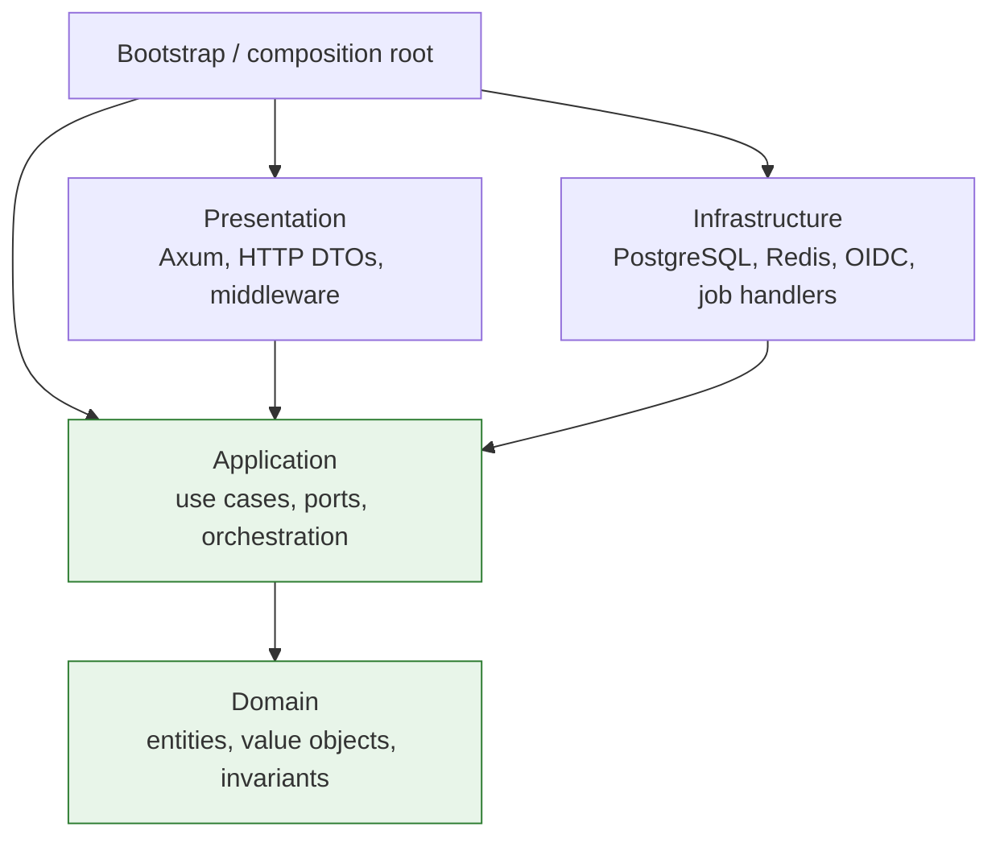

The diagram shows compile-time knowledge, not request order. Infrastructure implements traits owned by the application layer; it does not become an inner business layer.

### Ports and adapters

The application owns these primary boundary contracts:

| Port | Purpose | Current adapter |
| --- | --- | --- |
| `UserRepository` | User CRUD persistence | `PostgresUserRepository` |
| `UserRegistrationRepository` | Atomic user plus initial-job creation | `PostgresUserRepository` |
| `UserCache` | Optional cache-aside operations | `RedisUserCache` or `NoOpUserCache` |
| `TraceContextProvider` | Capture producer trace context | `OpenTelemetryTraceContext` |
| `AccessTokenVerifier` | Verify a Bearer access token | `OidcAccessTokenVerifier` |
| `ReadinessCheck` | Report required-dependency readiness | `PostgresReadinessCheck` |
| `JobQueue` | Durable job lifecycle | `PostgresJobQueue` |
| `JobHandler` | Execute work for a job type | `UserCreatedHandler` |
| `JobTracer` | Create a consumer span | `OpenTelemetryJobTracer` |

Concrete use cases are not hidden behind use-case traits. They are shared as `Arc<ConcreteUseCase>`, while dynamic dispatch is reserved for external boundaries.

### Consistency priorities

The architecture deliberately applies different consistency models:

- PostgreSQL writes are strongly transactional.
- User creation and job enqueue are atomic.
- User updates use optimistic concurrency through `updated_at`.
- Redis is eventually consistent and bounded by TTL.
- Background side effects are at-least-once, not exactly-once.
- Authentication fails closed when stale signing keys cannot be refreshed.

## Repository and dependency structure

```text
src/
├── domain/                  Pure user model and validation
├── application/             Use cases, errors, ports, auth/job contracts
├── infrastructure/          PostgreSQL, Redis, OIDC, concrete job handlers
├── presentation/http/       Axum routes, middleware, DTOs, responses
├── bootstrap/               Runtime selection and dependency wiring
├── config/                  Environment parsing and validation
├── telemetry/               Logs, traces, metrics, propagation
├── cli.rs                   Command-line interface
├── lib.rs                   Library module exports
└── main.rs                  Process entry point

migrations/                  Embedded SQLx migrations
tests/                       HTTP and PostgreSQL integration tests
docs/                        Operational and architecture documentation
.github/workflows/ci.yml     Quality, audit, release, and image CI
Dockerfile                   Multi-stage production image
compose.yaml                 Local PostgreSQL and Redis
```

### Layer responsibilities

| Layer | Owns | Must not own |
| --- | --- | --- |
| Domain | Business entities, value objects, invariants | HTTP, SQL, Redis keys, environment configuration |
| Application | Use-case orchestration, ports, application errors | Axum types, SQLx errors, concrete clients |
| Infrastructure | Queries, remote calls, serialization, adapter error mapping | HTTP response semantics, business policy |
| Presentation | HTTP extraction, routing, auth middleware, status/error mapping | SQL, dependency construction, core business rules |
| Bootstrap | Process lifecycle, configuration, concrete wiring | Reusable business behavior |
| Telemetry | Provider setup, propagation, safe instruments | Business decisions |

## Runtime modes and startup

The executable exposes four operational paths:

```text
base_skeleton_rust
├── http
├── worker
├── all [--migrate]
└── db
    ├── migrate
    ├── info
    └── revert --yes
```

### Process entry

`main.rs` performs the same initial steps for every command:

1. Load `.env` when present.
2. Initialize telemetry and W3C propagation.
3. Parse the CLI command.
4. Dispatch through `bootstrap::run`.
5. Shut down meter, logger, and tracer providers so buffered telemetry can flush.

### HTTP mode

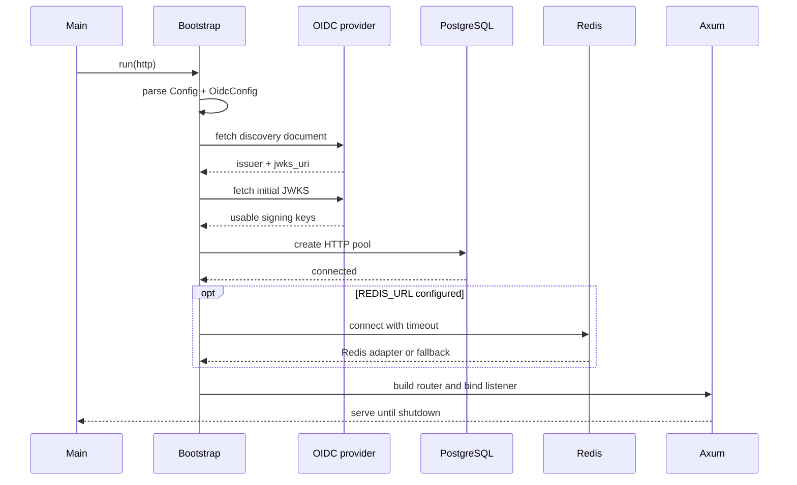

HTTP startup fails if configuration, OIDC discovery/JWKS, PostgreSQL connection, or TCP bind fails. Redis connection failure does not fail startup; the composition root installs `NoOpUserCache` instead.

### Worker mode

Worker mode does not load OIDC configuration. It:

1. Parses common configuration.
2. Creates its own PostgreSQL pool.
3. Registers job handlers by static job type.
4. Uses the configured worker ID or generates `worker-<uuid>`.
5. Runs cleanup immediately and then at the configured interval.
6. Repeatedly claims and processes one job.
7. Sleeps for the poll interval only after an idle or failed queue iteration.
8. Finishes active work before stopping after a shutdown signal.

### Combined mode

`all` runs HTTP and worker futures in one process. It is appropriate for local development and simple deployments; independently deployed `http` and `worker` processes scale more cleanly in production.

The configured connection budget is split as follows:

| `DATABASE_MAX_CONNECTIONS` | HTTP pool | Worker pool |
| ---: | ---: | ---: |
| 1 | Startup rejected | Startup rejected |
| 2 | 1 | 1 |
| 5 | 2 | 3 |
| 6 | 3 | 3 |

If either component exits, combined mode requests shutdown of the other and returns the combined result.

### Database mode

Database commands use `MIGRATION_DATABASE_URL` when set, otherwise `DATABASE_URL`, and create a one-connection pool. This supports least privilege: runtime credentials can omit schema-changing privileges.

## HTTP architecture

### Endpoint inventory

| Method | Path | Authentication | Rate limited | Purpose |
| --- | --- | --- | --- | --- |
| `GET` | `/health` | Public | No | Liveness alias |
| `GET` | `/health/live` | Public | No | Process liveness |
| `GET` | `/health/ready` | Public | No | PostgreSQL and migration readiness |
| `GET` | `/metrics` | Static metrics Bearer token | No | Prometheus text; route absent when disabled |
| `POST` | `/api/v1/users` | OIDC `users:write` | Yes | Create a user and durable job |
| `GET` | `/api/v1/users` | OIDC `users:read` | Yes | List users with pagination |
| `GET` | `/api/v1/users/{id}` | OIDC `users:read` | Yes | Read one user, cache-aside |
| `PUT` | `/api/v1/users/{id}` | OIDC `users:write` | Yes | Optimistically update one user |
| `DELETE` | `/api/v1/users/{id}` | OIDC `users:write` | Yes | Delete one user |

### Request pipeline

```mermaid
flowchart LR
    Request[Incoming request]
    Sensitive[Mark Authorization and Cookie sensitive]
    RequestID[Generate x-request-id]
    Trace[Extract W3C context and create HTTP span]
    Timeout[Request timeout]
    Metrics[Active/count/duration metrics]
    BodyLimit[Body-size limit]
    Route{Route group}
    Rate[Per-IP token bucket]
    Auth[Bearer verification + scope]
    Handler[Thin Axum handler]
    UseCase[Application use case]
    Response[JSON response]

    Request --> Sensitive --> RequestID --> Trace --> Timeout --> Metrics --> BodyLimit --> Route
    Route -->|/api/*| Rate --> Auth --> Handler --> UseCase --> Response
    Route -->|health| Handler
    Route -->|metrics| Handler
```

Layer ordering is defined centrally in `presentation/http/router.rs`. All responses passing through the router receive an `x-request-id`. The request body limit and timeout are global. Authentication and rate limiting apply only to the user API router.

### HTTP DTO boundary

Presentation request types use Serde and remain outside the application/domain layers. Handlers convert:

```text
HTTP path/query/body
    → presentation request DTO
    → application input DTO / domain UserId
    → use-case result
    → presentation response DTO
    → JSON
```

List pagination defaults and clamps in the application layer: page is at least `1`, and `per_page` is between `1` and `100`.

### Error contract

Application and input errors use a stable JSON envelope:

```json
{
  "error": {
    "code": "user_not_found",
    "message": "user was not found"
  }
}
```

| Condition | Status | Code or behavior |
| --- | ---: | --- |
| Invalid UUID | 400 | `invalid_user_id` |
| Invalid JSON/query | 400 | `invalid_json` / `invalid_query` |
| Missing or invalid Bearer token | 401 | `unauthorized` plus `WWW-Authenticate` |
| Valid token without required scope | 403 | `insufficient_scope` plus challenge |
| Domain validation failure | 422 | `validation_failed` |
| Missing user | 404 | `user_not_found` |
| Duplicate email | 409 | `email_already_exists` |
| Optimistic update conflict | 409 | `conflict` |
| Required dependency unavailable | 503 | `service_unavailable` |
| Stale JWKS cannot refresh | 503 | `authentication_unavailable` |
| API token bucket exhausted | 429 | `rate_limit_exceeded` plus `Retry-After` |
| Request timeout | 408 | Generated by timeout middleware |

Server errors are logged at error level; expected client rejections are logged at warning level. Secrets and request bodies are not included.

## User domain and use cases

### Domain model

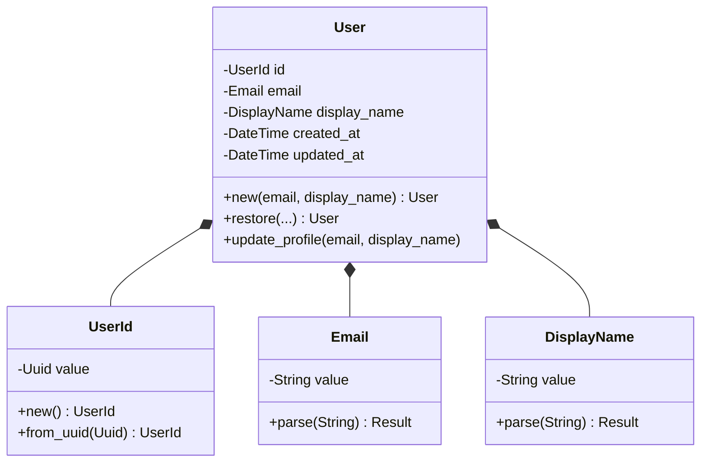

Domain invariants:

- Email is trimmed and lowercased.
- Email must contain a non-empty local and domain part, the domain must contain `.`, whitespace is forbidden, and its normalized UTF-8 representation is at most 254 bytes.
- Display name is trimmed and must contain 2–100 Unicode scalar values.
- `UserId` is a UUID generated in the domain constructor.
- Profile updates replace validated values and advance `updated_at`.
- Restoring persistence/cache records re-runs value-object validation; invalid stored data becomes an adapter failure rather than entering the domain.

### Create user

```mermaid
sequenceDiagram
    participant Client
    participant HTTP as Axum handler
    participant UC as CreateUserUseCase
    participant Domain
    participant PG as PostgresUserRepository
    participant Redis
    participant Worker

    Client->>HTTP: POST /api/v1/users
    HTTP->>UC: CreateUserInput
    UC->>Domain: parse Email + DisplayName; User::new
    UC->>UC: create user.created job + capture trace context
    UC->>PG: create_with_job(user, job)
    PG->>PG: BEGIN
    PG->>PG: INSERT users
    PG->>PG: INSERT background_jobs
    PG->>PG: COMMIT
    PG-->>UC: created User
    UC->>Redis: best-effort cache set
    UC-->>HTTP: User
    HTTP-->>Client: 201 JSON
    Worker->>PG: claim job asynchronously
```

The transactional outbox-like write prevents a committed user without its initial durable job. The job lives in the same database rather than a separate message broker.

### Get user

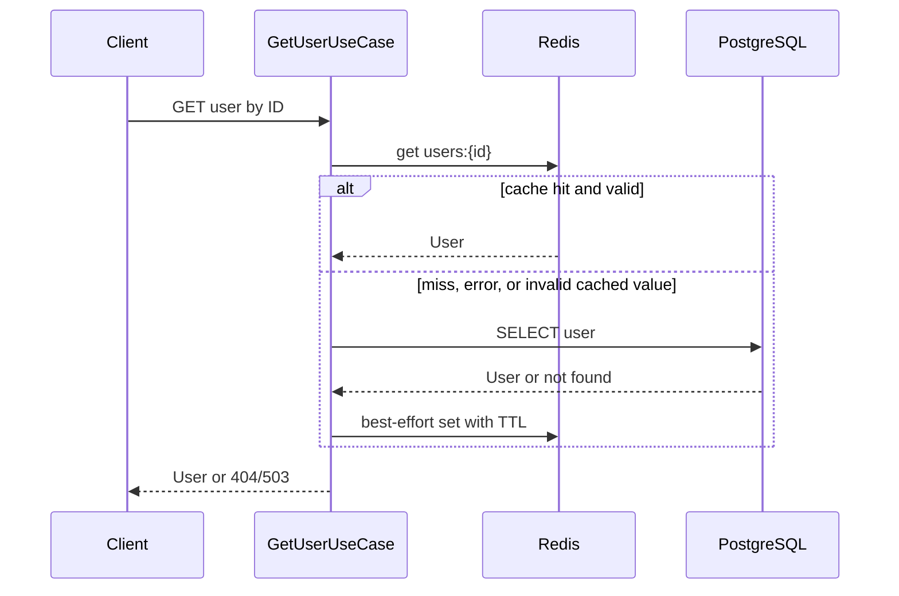

### List users

Lists always query PostgreSQL. Results are ordered by `created_at DESC, id DESC`, with normalized limit/offset pagination. The list is not cached, avoiding cache invalidation for changing collections.

### Update user

Update implements optimistic concurrency:

1. Read the current user.
2. Preserve its current `updated_at` as the expected version.
3. Apply validated domain changes, producing a new timestamp.
4. Update only where `id` and old `updated_at` both match.
5. If no row changed, re-read to distinguish deleted (`404`) from modified (`409`).
6. Best-effort refresh Redis. If cache set fails, attempt deletion so a stale entry expires or is removed.

### Delete user

Delete removes the PostgreSQL row first. A missing row returns `404`. Redis invalidation is best effort; if deletion fails, a warning is emitted and the stale entry is bounded by cache TTL.

## Authentication and authorization

### OIDC startup discovery

HTTP startup validates and loads:

1. `OIDC_ISSUER_URL` syntax and scheme.
2. `/.well-known/openid-configuration`.
3. Exact discovered issuer equality, ignoring only a configured trailing slash.
4. A non-empty JWKS URI with an allowed scheme.
5. An initial JWKS containing at least one usable signing key.

HTTP is required unless `OIDC_ALLOW_INSECURE_HTTP=true`; that exception is intended only for local development.

### Token verification

```mermaid
sequenceDiagram
    participant Client
    participant Auth as Scope middleware
    participant Verifier as OIDC verifier
    participant Cache as JWKS cache
    participant IdP as OIDC provider
    participant Handler

    Client->>Auth: Authorization: Bearer JWT
    Auth->>Verifier: verify(token)
    Verifier->>Verifier: decode header; validate alg + kid
    Verifier->>Cache: find fresh matching key
    alt key present and cache fresh
        Cache-->>Verifier: JWK
    else unknown key or stale cache
        Verifier->>Verifier: acquire single-flight refresh mutex
        alt refresh throttle permits attempt
            Verifier->>IdP: GET JWKS
            IdP-->>Verifier: new key set or error
            Verifier->>Cache: replace complete key set
        else retry throttled
            Verifier-->>Auth: invalid or authentication unavailable
        end
    end
    Verifier->>Verifier: verify signature + claims + lifetime
    Verifier-->>Auth: principal(subject, scopes)
    Auth->>Auth: check required scope
    Auth->>Handler: attach principal to request extensions
```

### Cryptographic and claim checks

The verifier enforces:

- Configured asymmetric algorithms only; HMAC algorithms are rejected during configuration.
- Token `alg` must be allowed.
- A non-empty `kid` must identify a usable key.
- JWK key type must match the algorithm.
- JWK `use`, key operations, and declared algorithm must permit signature verification when supplied.
- Signature must verify.
- `iss`, `aud`, `exp`, `iat`, and `sub` are required.
- `nbf`, when present, is validated.
- `sub` must not be blank.
- `iat` may not be in the future beyond configured clock skew.
- `exp` must not precede `iat`.
- `exp - iat` may not exceed `OIDC_MAX_TOKEN_LIFETIME_SECONDS`.
- `scope` is interpreted as a space-delimited set.

### JWKS availability model

The key cache has two independent timers:

- `OIDC_JWKS_MAX_AGE_SECONDS` determines whether cached material is still trustworthy.
- `OIDC_JWKS_REFRESH_INTERVAL_SECONDS` throttles unknown-key refresh and retry attempts.

Fresh cached keys continue to verify tokens during a temporary provider outage. Once stale, refresh is mandatory even if `kid` has not changed. Failed stale refresh returns `503 authentication_unavailable`; stale keys are not used indefinitely. A mutex provides single-flight refresh so concurrent requests do not stampede the provider.

### Scope policy

| Route class | Required scope |
| --- | --- |
| User reads (`GET`, `HEAD`) | `users:read` |
| User writes (`POST`, `PUT`, `DELETE`) | `users:write` |

Authentication is enforced at the router boundary. Verified principals are inserted into request extensions for handlers that need actor context in future features.

## Rate limiting and proxy trust

`tower-governor` implements a keyed token bucket for `/api/*`.

- Sustained refill rate: `RATE_LIMIT_REQUESTS_PER_MINUTE`.
- Maximum immediate bucket capacity: `RATE_LIMIT_BURST`.
- Key: derived client IP.
- Rejection: JSON `429` with `Retry-After` and a rate-limit rejection metric.
- Exclusions: liveness, readiness, and metrics.

### Client-IP selection

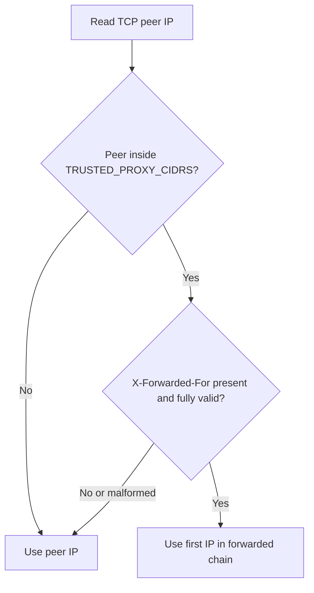

The service never trusts forwarding headers from arbitrary clients. Operators must list only actual proxy CIDRs and configure the proxy to overwrite, rather than append blindly to, client-supplied forwarding headers.

## Persistence and consistency

### Data model

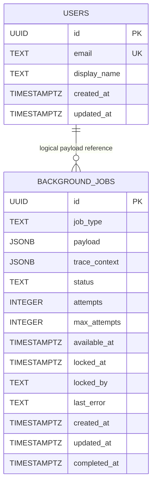

There is no foreign key between `users` and `background_jobs`; job payloads are historical work items and may outlive deletion of their source entity.

### `users` table

- UUID primary key.
- Database-enforced unique email constraint named `users_email_unique`.
- `created_at DESC` index supports newest-first listing.
- PostgreSQL unique-constraint errors map specifically to `RepositoryError::DuplicateEmail`; other driver errors become `Unavailable`.

### `background_jobs` constraints

The schema enforces:

- Non-blank job type length between 1 and 200.
- Status in `pending`, `running`, `completed`, or `dead`.
- Non-negative attempts and positive max attempts.
- Attempts never exceed max attempts.
- Only running jobs may have `locked_at`/`locked_by`, and running jobs must have both.
- Only completed jobs may have `completed_at`, and completed jobs must have it.

Partial indexes support pending selection and expired running-lease discovery. A type/status index supports operational inspection.

### Transaction boundaries

| Operation | Transaction behavior |
| --- | --- |
| Create user with job | Explicit transaction around both inserts |
| Claim job | Explicit transaction around lease recovery and one `SKIP LOCKED` claim |
| Complete/fail job | Single conditional update guarded by worker ownership |
| Update/delete user | Single statement; update uses optimistic timestamp condition |

## Redis caching

Redis stores serialized users under `users:{uuid}` with `USER_CACHE_TTL_SECONDS`.

### Availability behavior

- No `REDIS_URL`: install `NoOpUserCache`.
- Invalid Redis URL: startup fails because configuration is invalid.
- Connection failure or timeout: log warning and install `NoOpUserCache`.
- Runtime get failure: treated like a cache miss by the get use case.
- Runtime set/delete failure: request remains successful; warnings or compensating invalidation may occur.
- Cached data that violates domain validation is rejected as a cache error.

Redis is excluded from readiness because it does not own authoritative data.

## Durable background jobs

### Job lifecycle

```mermaid
stateDiagram-v2
    [*] --> pending: enqueue
    pending --> running: claim; attempts += 1; lease owner set
    running --> completed: handler succeeds and owner completes
    running --> pending: handler fails and attempts < max; delayed retry
    running --> dead: handler fails and attempts >= max
    running --> pending: lease expires and budget remains
    running --> dead: lease expires and budget exhausted
    completed --> [*]: retention cleanup
    dead --> [*]: dead retention cleanup
```

### Claiming and concurrency

Workers select one eligible pending job ordered by `available_at, created_at` using `FOR UPDATE SKIP LOCKED`. Multiple workers can safely share the queue without a central coordinator. Claiming increments attempts and records the worker lease.

Before selecting work, each claim transaction recovers expired running jobs:

- Requeue as `pending` when attempts remain.
- Mark `dead` when the attempt budget is exhausted.
- Clear lease fields and record `worker lease expired`.

### Ownership

Completion and failure updates require all of:

- Matching job ID.
- Current status `running`.
- Matching `locked_by` worker ID.

Zero affected rows means `LeaseLost`. A slow worker therefore cannot overwrite a job after ownership has moved elsewhere.

### Retry policy

Retry delay is exponential and capped:

```text
delay = min(JOB_RETRY_BASE_SECONDS × 2^(attempt - 1), JOB_RETRY_MAX_SECONDS)
```

The exponent is safely capped. Stored handler error text is truncated to 4,000 characters.

### Delivery semantics and idempotency

Delivery is at least once. A handler may complete its external side effect and crash before the queue completion update commits, causing later redelivery. Every production handler must therefore use an idempotency key or an idempotent destination operation. The job UUID is the natural idempotency key.

### Handler registry

`JobWorker` builds a map from static `job_type` to handler. The current `user.created` handler validates a UUID payload and logs successful processing; it intentionally demonstrates the queue path rather than calling a real external system. Unknown job types fail, retry, and eventually become dead.

### Cleanup

Cleanup runs immediately at worker startup and every `JOB_CLEANUP_INTERVAL_SECONDS`, independent of job success. One pass deletes at most 1,000 oldest terminal rows:

- `completed` rows older than `JOB_COMPLETED_RETENTION_SECONDS`, based on `completed_at`.
- `dead` rows older than `JOB_DEAD_RETENTION_SECONDS`, based on `updated_at`.

### Trace propagation through jobs

The create use case injects current W3C trace context into the job's `trace_context` JSON. The worker extracts it and creates `job.process` as a consumer child span. HTTP request and asynchronous work can therefore appear in one distributed trace even across processes.

## Migrations and readiness

### Embedded migrator

`sqlx::migrate!()` embeds migration files in the binary through one shared `MIGRATOR`. `build.rs` asks Cargo to rebuild when `migrations/` changes.

Migration history:

| Version | Purpose |
| ---: | --- |
| `0001` | Create users and newest-first index |
| `0002` | Give the user email unique constraint a stable name |
| `0003` | Create durable background job table, constraints, and indexes |
| `0004` | Add non-null JSONB W3C trace context |

### Commands

- `db migrate`: apply all pending migrations.
- `db info`: print each embedded migration as applied, pending, failed, or checksum-mismatched, and report versions missing from the binary.
- `db revert --yes`: revert only when the latest applied version has an embedded down migration. Current forward-only migrations are intentionally not reversible.

`migration:create <name>` creates a forward-only `.sql` migration by default. Use `migration:create --reversible <name>` to create matching `.up.sql` and `.down.sql` files for a deliberately reversible change.

Never edit an applied migration. Add a corrective forward migration instead.

### Readiness definition

`/health/ready` returns ready only when:

1. PostgreSQL is reachable.
2. `_sqlx_migrations` exists in the current schema.
3. Applied migration count equals the binary's expected up-migration count.
4. Every applied version exists in the binary.
5. Every expected version is present and successful.
6. Every stored checksum matches the embedded migration checksum.

Missing, extra, failed, or modified migrations make readiness return `503`. This prevents traffic from reaching a binary/schema combination that merely has similarly named tables but is not the expected schema.

Liveness does not query dependencies; it only proves the HTTP process can answer.

## Observability

### Telemetry topology

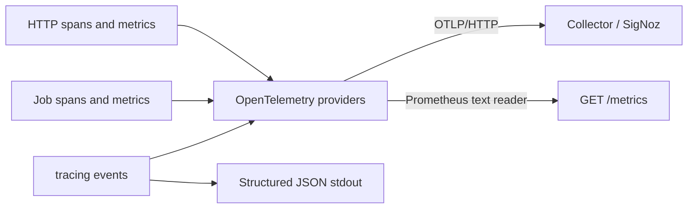

### Logs

- Structured JSON is always written to stdout.
- `RUST_LOG` controls filtering.
- When OTLP is configured, a tracing bridge exports logs with active trace/span context.
- OpenTelemetry-internal targets are filtered from the log bridge to avoid feedback noise.
- Telemetry providers flush during orderly process shutdown.

### Traces

- W3C `traceparent` and `tracestate` are extracted from HTTP headers.
- Root server spans record method, URL path, response status, trace ID, and span ID.
- HTTP 5xx responses mark the server span as error.
- Use cases and adapters have nested instrumentation spans.
- Durable jobs restore producer context and create consumer spans.

Authorization headers, cookies, bodies, emails, display names, job payloads, SQL parameters, and connection strings are not added to spans/logs by the application.

### Metrics

| Instrument | Type | Important attributes |
| --- | --- | --- |
| `http.server.requests` | Counter | method, normalized route, status |
| `http.server.request.duration` | Histogram (seconds) | method, normalized route, status |
| `http.server.active_requests` | Up/down counter | method, normalized route |
| `http.server.rate_limit.rejections` | Counter | none |
| `job.process.outcomes` | Counter | job type, bounded outcome |
| `job.process.duration` | Histogram (seconds) | job type, bounded outcome |
| `job.cleanup.deleted` | Counter | none |
| `job.worker.errors` | Counter | bounded operation (`cleanup` or `iteration`) |

HTTP metric routes are normalized to `/api/v1/users/{id}` or a fixed known route. IP addresses, subjects, UUIDs, and raw paths are not metric attributes.

### Export modes

- With `OTEL_EXPORTER_OTLP_ENDPOINT`: logs, traces, and metrics export over OTLP/HTTP.
- Without it: structured stdout remains; OTLP exporters are not installed.
- With `METRICS_PROMETHEUS_BEARER_TOKEN`: a Prometheus reader is installed and `/metrics` is mounted.
- Without the token: `/metrics` is not mounted and returns normal `404` routing behavior.

Metrics authentication uses constant-time token comparison and never logs the configured token.

## Configuration reference

### Server, database, and cache

| Variable | Default | Required | Meaning |
| --- | --- | --- | --- |
| `APP_HOST` | `0.0.0.0` | No | HTTP bind host |
| `APP_PORT` | `3000` | No | HTTP bind port |
| `DATABASE_URL` | — | Yes | Runtime PostgreSQL connection string |
| `MIGRATION_DATABASE_URL` | `DATABASE_URL` | No | Optional privileged migration connection |
| `DATABASE_MAX_CONNECTIONS` | `10` | No | Pool budget; `all` requires at least 2 and splits it |
| `REDIS_URL` | Disabled | No | Optional Redis endpoint |
| `REDIS_CONNECT_TIMEOUT_SECONDS` | `3` | No | Startup cache connection timeout |
| `USER_CACHE_TTL_SECONDS` | `300` | No | Per-user cache TTL |
| `REQUEST_TIMEOUT_SECONDS` | `10` | No | Global HTTP request deadline |
| `MAX_REQUEST_BODY_BYTES` | `65536` | No | Global request-body limit |

All numeric values above that represent sizes, limits, or timeouts must be positive.

### OIDC

| Variable | Default | Required | Meaning |
| --- | --- | --- | --- |
| `OIDC_ISSUER_URL` | — | HTTP/all only | Exact issuer and discovery base URL |
| `OIDC_AUDIENCE` | — | HTTP/all only | Dedicated API audience |
| `OIDC_ALLOWED_ALGORITHMS` | `RS256` | No | Comma-separated asymmetric algorithms |
| `OIDC_ALLOW_INSECURE_HTTP` | `false` | No | Permit HTTP issuer/JWKS for local development |
| `OIDC_HTTP_TIMEOUT_SECONDS` | `5` | No | Discovery and JWKS HTTP timeout |
| `OIDC_CLOCK_SKEW_SECONDS` | `30` | No | Timestamp validation leeway |
| `OIDC_JWKS_REFRESH_INTERVAL_SECONDS` | `60` | No | Minimum refresh/retry interval |
| `OIDC_JWKS_MAX_AGE_SECONDS` | `300` | No | Maximum usable cached-key age |
| `OIDC_MAX_TOKEN_LIFETIME_SECONDS` | `3600` | No | Maximum `exp - iat` |

### Rate limiting and metrics endpoint

| Variable | Default | Meaning |
| --- | --- | --- |
| `RATE_LIMIT_REQUESTS_PER_MINUTE` | `120` | Sustained token refill rate per IP |
| `RATE_LIMIT_BURST` | `30` | Maximum immediate tokens per IP |
| `TRUSTED_PROXY_CIDRS` | Empty | Comma-separated peers allowed to provide `X-Forwarded-For` |
| `METRICS_PROMETHEUS_BEARER_TOKEN` | Disabled | Static secret that enables and protects `/metrics` |

### Worker

| Variable | Default | Meaning |
| --- | --- | --- |
| `JOB_POLL_INTERVAL_MILLISECONDS` | `1000` | Idle/error poll delay |
| `JOB_LEASE_TIMEOUT_SECONDS` | `300` | Time before running ownership is recoverable |
| `JOB_RETRY_BASE_SECONDS` | `5` | Exponential retry base |
| `JOB_RETRY_MAX_SECONDS` | `300` | Retry-delay ceiling; must be at least base |
| `JOB_MAX_ATTEMPTS` | `5` | Attempt budget assigned to new jobs |
| `JOB_WORKER_ID` | Generated UUID | Lease owner identity; must be unique across workers |
| `JOB_COMPLETED_RETENTION_SECONDS` | `86400` | Completed retention (1 day) |
| `JOB_DEAD_RETENTION_SECONDS` | `2592000` | Dead retention (30 days) |
| `JOB_CLEANUP_INTERVAL_SECONDS` | `3600` | Maintenance interval (1 hour) |

### Telemetry

| Variable | Default | Meaning |
| --- | --- | --- |
| `RUST_LOG` | Application/tower debug filter | Structured logging filter |
| `OTEL_EXPORTER_OTLP_ENDPOINT` | Disabled | Generic OTLP/HTTP endpoint |
| `OTEL_EXPORTER_OTLP_HEADERS` | Empty | Collector authentication headers |
| `OTEL_SERVICE_NAME` | Cargo package name | OpenTelemetry `service.name` |
| `OTEL_METRIC_EXPORT_INTERVAL` | SDK default | Periodic OTLP metric interval in milliseconds |

Secrets such as database passwords, OTLP headers, Redis credentials, and metrics tokens must come from deployment secret management and must never be committed.

## Deployment architecture

### Recommended production topology

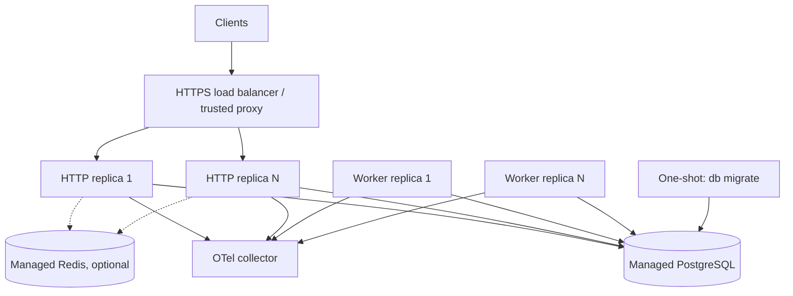

Recommended order:

1. Build and scan one immutable image.
2. Back up or confirm recoverability of PostgreSQL.
3. Run `db migrate` as a one-shot deployment step using migration credentials.
4. Start or roll worker replicas.
5. Start or roll HTTP replicas.
6. Route traffic only after readiness succeeds.
7. Confirm logs, traces, metrics, job outcomes, and dead-job count.

### Container image

The multi-stage Dockerfile:

- Builds with `cargo build --release --locked`.
- Copies only the release binary into Debian Bookworm slim.
- Installs CA certificates and `curl`.
- Runs as UID 10001 rather than root.
- Defaults to `http` while accepting any CLI subcommand after the entrypoint.
- Exposes port 3000.
- Uses `/health/live` for Docker health checks.

The same artifact must run both migration and runtime commands, preventing version drift between schema and application binary.

### Graceful shutdown

SIGINT/Ctrl+C and SIGTERM send a watch-channel shutdown signal.

- HTTP stops accepting work through Axum graceful shutdown.
- Worker checks shutdown between jobs and finishes an active handler before exiting.
- Combined mode coordinates component exit.
- Telemetry providers shut down after the runtime returns.

The process does not forcibly cancel long-running handlers. Set lease timeout above normal maximum handler duration, and let the platform's termination grace period exceed that duration.

## Failure model

| Failure | Startup effect | Runtime effect | Readiness | Recovery behavior |
| --- | --- | --- | --- | --- |
| Invalid required configuration | Process fails | N/A | N/A | Correct configuration |
| PostgreSQL unavailable at startup | HTTP/worker fails | N/A | N/A | Platform restarts after DB recovery |
| PostgreSQL unavailable later | Requests/jobs return dependency errors | `503` | Not ready | Pools reconnect; worker retries polling |
| Migration mismatch | Process may run but readiness fails | Traffic should not be routed | `503` | Run matching migrations/deploy matching binary |
| Redis absent or connection fails at startup | Startup continues | No cache | Ready | No-op cache until restart/reconfiguration |
| Redis fails later | Cache operations degrade | PostgreSQL remains authoritative | Ready | Cache-aside retries on later operations |
| OIDC discovery/JWKS unavailable at startup | HTTP/all fails | N/A | N/A | Restore IdP/network and restart |
| IdP unavailable with fresh cached key | Startup already complete | Matching tokens continue temporarily | Ready | Cache remains usable until max age |
| IdP unavailable after JWKS becomes stale | No restart required | Auth returns `503` | DB readiness may remain ready | Restore IdP; refresh retry is throttled |
| Unknown token `kid`, successful refresh but key absent | None | `401` invalid token | Ready | Client obtains a valid token |
| Rate limit exceeded | None | `429` with retry hint | Ready | Bucket refills over time |
| Worker crashes while running | None | Lease remains until timeout | HTTP readiness unaffected | Another worker requeues/dead-letters after lease expiry |
| Handler repeatedly fails | None | Exponential retry, then dead | Ready | Fix cause, inspect/requeue dead job if appropriate |
| Telemetry backend unavailable | Startup may fail only if exporter construction is invalid; later export is best effort | Application continues, stdout logs remain | Ready | SDK retries/continues periodic export according to exporter behavior |

## Scaling and capacity

### HTTP scaling

HTTP replicas are stateless except for in-process JWKS caches and rate-limit buckets. They can scale horizontally behind a load balancer. Consequences:

- Rate limits are per replica, not globally coordinated. A client distributed across replicas can receive approximately the sum of replica capacities.
- Each replica creates its own PostgreSQL pool and Redis connection manager.
- Each replica independently refreshes JWKS, though refresh within a replica is single-flight.

If a globally strict rate limit is required, enforce it at the edge or replace the in-memory limiter with a shared backend.

### Worker scaling

Workers scale horizontally because `SKIP LOCKED` distributes eligible rows. Capacity depends on handler duration, poll behavior, and PostgreSQL connection limits. Keep worker IDs unique.

The current worker processes one job at a time per process. Increase replicas for concurrency, or deliberately introduce bounded in-process concurrency later while preserving leases, shutdown semantics, and database capacity.

### Database connection budgeting

For separate processes, `DATABASE_MAX_CONNECTIONS` applies independently to each HTTP or worker process. Total potential connections are approximately:

```text
(HTTP replicas × HTTP max connections)
+ (worker replicas × worker max connections)
+ migration/admin connections
```

Size this below the PostgreSQL connection ceiling with room for operations. In combined mode the single configured budget is divided between HTTP and worker.

### Queue growth

Monitor pending/dead counts and age of oldest pending job. Retention cleanup bounds terminal rows but does not remove pending/running jobs. Sustained enqueue rate above handler throughput causes unbounded pending growth until capacity or storage is exhausted.

## Testing and delivery pipeline

### Test layers

| Layer | Location | What it proves |
| --- | --- | --- |
| Domain unit | Domain modules | Value-object invariants and normalization |
| Application unit | `src/application/*/tests.rs` | Use-case behavior using fake ports; retry calculations and outcomes |
| Infrastructure unit | Adapter modules | Payload parsing, OIDC claim/JWKS behavior, proxy extraction, metric format |
| HTTP integration | `tests/http_api.rs` | Routing, auth, scopes, JSON/errors, health, rate limit, metrics route behavior |
| PostgreSQL integration | `tests/postgres_job_queue.rs` | Claim/retry/dead/complete lifecycle and retention cleanup |

PostgreSQL tests skip locally with an explicit message when `TEST_DATABASE_URL` is absent. In CI, absence of that variable is a hard failure.

### CI pipeline

Every push and pull request, plus a weekly schedule, runs:

1. Rust formatting check.
2. Clippy for all targets/features with warnings denied.
3. All tests against PostgreSQL 17.
4. Locked release build.
5. RustSec `cargo audit`.
6. Production Docker image build.

The weekly run detects advisories even when source dependencies have not changed. `.cargo/audit.toml` documents the narrowly scoped advisory exception for an unused SQLx MySQL adapter locked by SQLx macros.

## How to extend the system

### Add a user feature

Follow the dependency direction:

1. Define observable behavior and failures.
2. Add or change domain invariants only when business rules require it.
3. Add one concrete application use case and input DTO.
4. Extend the smallest appropriate application port.
5. Implement the port in infrastructure and add migrations when necessary.
6. Add HTTP request/response types and a thin handler.
7. Register route scope policy explicitly.
8. Wire the use case in `AppState` and `bootstrap/dependencies.rs`.
9. Add domain, use-case, HTTP, and persistence tests proportionate to the change.

### Add a background job

1. Define a stable dotted job type such as `user.welcome_email`.
2. Define a minimal, version-tolerant JSON payload with stable identifiers, not secrets.
3. Create the job inside the same transaction as the state change it represents.
4. Implement `JobHandler` in infrastructure.
5. Validate/deserialise payload at the handler boundary.
6. Make the side effect idempotent using the job UUID or destination idempotency facility.
7. Register the handler in `bootstrap/worker.rs`.
8. Add success, retry, dead-letter, tracing, and redelivery tests.
9. Add bounded metrics only; never label metrics by job UUID or user ID.

### Add a new external dependency

1. Define a narrow application-owned port around required behavior.
2. Implement the client in infrastructure.
3. Decide explicitly whether failure is required, optional, or degradable.
4. Wire it only in bootstrap.
5. Define timeout, retry, circuit-breaking, readiness, secrets, and telemetry policy.
6. Do not expose the vendor SDK or error types to the application/domain.

### Add an endpoint

Before registering it, decide:

- Read or write scope.
- Whether it belongs under rate-limited `/api/*`.
- Stable normalized metric route.
- Request-body size implications.
- Error-envelope mapping.
- Whether it creates durable asynchronous work.

Update `normalized_route` when adding a new route pattern; otherwise metrics use the bounded `unmatched` label.

### Add a migration

1. Add the next immutable SQL file under `migrations/`.
2. Prefer forward-compatible additive changes.
3. Update queries and row mapping.
4. Run `db info` and `db migrate` against an isolated database.
5. Add integration coverage for constraints or durable behavior.
6. Never change a migration already applied outside disposable development databases.

## Current boundaries and deliberate limitations

- The current business domain is only user CRUD.
- `user.created` demonstrates handler mechanics but performs no external side effect.
- There is no Kubernetes manifest or infrastructure-as-code in this repository.
- Redis is not used for shared rate limiting.
- Rate-limit state is process-local and resets on restart.
- Metrics authentication uses one static Bearer secret; there is no metrics-specific OIDC policy.
- OIDC discovery occurs only at startup; the issuer and JWKS URI are not rediscovered periodically. JWKS contents are refreshed.
- The job queue has no archive table or administrative HTTP API.
- Dead jobs are permanently deleted after retention unless operators export them externally.
- Jobs are processed serially within each worker process.
- There is no automatic heartbeat/lease extension for a handler that runs longer than `JOB_LEASE_TIMEOUT_SECONDS`.
- Pagination is offset-based and has no total-count response.
- There is no formal OpenAPI specification yet.
- PostgreSQL readiness verifies migration state, not a synthetic write transaction.

These are design boundaries, not hidden guarantees. Revisit them when product requirements demand stricter global rate limits, long-running jobs, archival, cursor pagination, or richer platform deployment automation.

## Source map and glossary

### Source map

| Concern | Primary source |
| --- | --- |
| Process entry and telemetry lifecycle | `src/main.rs` |
| CLI commands | `src/cli.rs` |
| Environment validation | `src/config/mod.rs` |
| Runtime selection and pool split | `src/bootstrap/mod.rs` |
| HTTP wiring | `src/bootstrap/http.rs`, `src/presentation/http/router.rs` |
| Dependency construction | `src/bootstrap/dependencies.rs` |
| Worker loop | `src/bootstrap/worker.rs` |
| Migration commands | `src/bootstrap/database.rs` |
| User rules | `src/domain/user/` |
| User orchestration and ports | `src/application/user/` |
| Job contracts/orchestration | `src/application/job/` |
| PostgreSQL adapters | `src/infrastructure/database/postgres/` |
| Redis adapter | `src/infrastructure/cache/redis/` |
| OIDC verification | `src/infrastructure/oidc/mod.rs` |
| HTTP auth and errors | `src/presentation/http/auth.rs`, `error.rs` |
| Rate limiting and proxy trust | `src/presentation/http/rate_limit.rs` |
| Prometheus endpoint | `src/presentation/http/metrics.rs` |
| OpenTelemetry | `src/telemetry/mod.rs` |
| Schema | `migrations/` |
| Container | `Dockerfile` |
| CI/security audit | `.github/workflows/ci.yml`, `.cargo/audit.toml` |

### Glossary

| Term | Meaning in this system |
| --- | --- |
| Adapter | Concrete implementation of an application port, such as PostgreSQL or Redis |
| Application port | Trait describing behavior needed across an external boundary |
| At-least-once | A job may execute more than once, so handlers must be idempotent |
| Combined mode | One process running both HTTP and worker with a split DB pool budget |
| Dead job | A failed or abandoned job with no remaining attempts |
| JWKS | Provider-published JSON Web Key Set used to verify JWT signatures |
| Lease | Time-bounded worker ownership recorded with `locked_at` and `locked_by` |
| Liveness | Proof the HTTP process answers; it does not validate dependencies |
| Optimistic concurrency | Conditional update using the previously read `updated_at` value |
| Readiness | Proof PostgreSQL is reachable and migration state exactly matches the binary |
| Single-flight | One concurrent JWKS refresh while other requests wait and recheck the cache |
| Source of truth | PostgreSQL; Redis never overrides it |
| Token bucket | Rate-limit algorithm with bounded burst capacity and periodic refill |
| Transactional outbox pattern | Writing domain state and durable asynchronous intent in one transaction; here the queue table is in the same PostgreSQL database |
